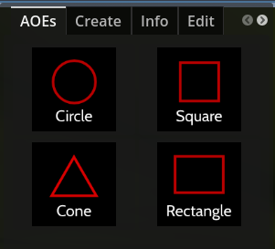
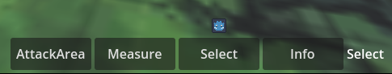
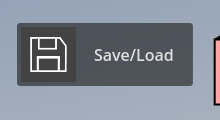
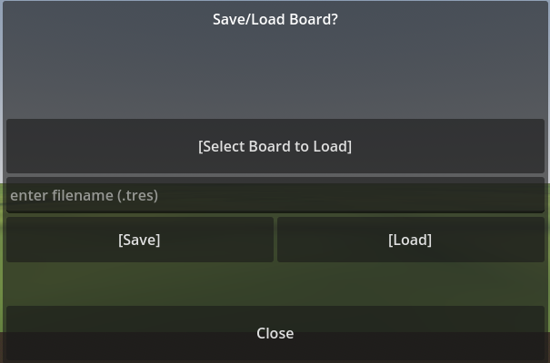

## Setup & Run
- Download Godot 4.5
- Download the repo files
- Open the project in Godot
- Run the project (press (F5)) or hit the Play button in the top right of the editor
- Make sure the input mode in the top left of the game is (Input)

## Controls
### Camera:
	
# 3D Controls
- **W**: Forward
- **S**: Backward
- **A**: Left
- **D**: Right
- **Q** or **Space**: Up
- **E** or **Shift**: Down

# 2D Controls
- **W**: Up
- **S**: Down
- **A**: Left
- **D**: Right
- **Q** or **Space**: Forward
- **E** or **Shift**: Backward

Roll the **scroll wheel** to increase and decrease movement speed.

Hold down the **right mouse button** to rotate the camera.

## General features
# Menu

On the left side is the board_menu. Here there are different tabs for different features.
- **AOEs**: Sets the type of Area of Effects for **AttackArea**. (Circle, Square, Cone, Rectangle)
- **Create**: Fill out one of the tabs and then it creates a spawners for the **Add** or **Map** tab.
- **Info**: Provides info on the object on the board you selected.
- **Edit**: Allows you to edit data on the object you are currently selecting.
- **Add**: Adds a created object to the board. You can toggle (Persistent) and the spawner will persist when you load a new board. Intended for player characters that would be used across multiple maps. Otherwise, the spawner will be deleted to make way for the spawners in the loaded board.
- **Map**: Changes the map on the board.

# Toolbar

On the bottom is the toolbar. Here the different states determine what happens when you click on the board. 
- **AttackArea**: (select with keyboard button (1)) Draw area of effects in a range from a point where you click (and hold) and then a point where you drag to.
- **Measure**: (select with keyboard button (2)) Draws a straight line between 2 points. Where you initially click, and then where you drag your mouse to.
- **Select**: (select with keyboard button (3)) Allows you to move objects on the board by clicking and dragging their bases(the green rectangle beneath figures, which also are inside objects just move your camera inside the 3D models to see them.)
- **Info**: (select with keyboard button (4)) Switches to the **Info** tab of the creature that was clicked on.

# Save/Load

On the top right is a Save/Load button. Click it to open the menu. 
- **[Select Board to Load]**: Opens the filesystem to where the boards are stored. Open one and it will fill the filename with the corresponding text.
- **[Save]**: Saves/Overwrites to a file with the given filename.
- **[Load]**: Loads the file with the given filename.
- **Close**: Closes the menu.

## DISCLAIMERS
3D models are created in different ways, and the origins/pivot points of those models may not actually be where the models are.
If you try to Add a model in and you see the base appear, but not the model, then the 3D model is likely a hundred or so meters away in the void.
Go to (Edit) and change the (Model Position) until you see the model. The y position is likely the value you'd want to change first.

Sometimes the Figures don't move when you try to click and drag them around. Just keep trying, it usually works if you click around the center of the token.
Also check in the (Edit) tab and if the (Locked in Place) value is toggled on.
